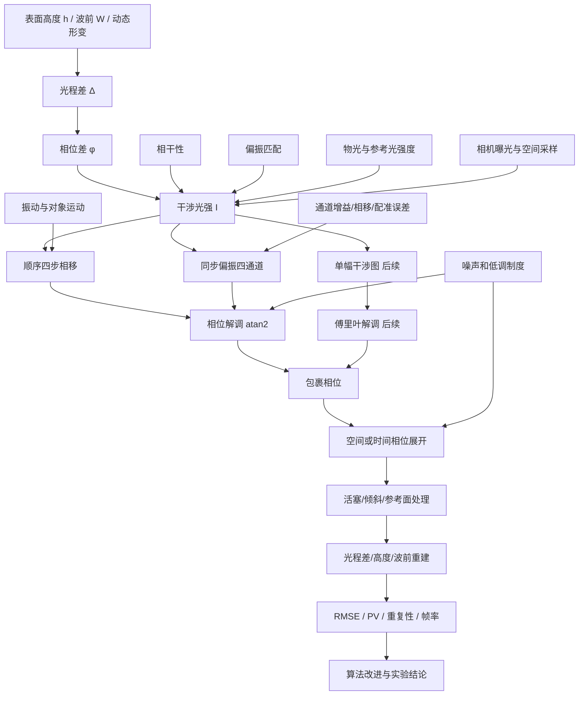

# 第一阶段知识地图与复习清单

## 1. 当前阶段判断

目前已经完成进入数值仿真所需的第一阶段基础理论：

- 双光束干涉与光程差；
- 相干条件与条纹可见度；
- 四步相移和包裹相位；
- 二维相位展开；
- 偏振光、Jones矩阵和同步偏振四步相移。

这意味着可以开始完成“已知相位—生成干涉图—恢复相位—评价误差”的Python闭环。

整个课题的理论尚未全部结束。完成基础仿真后，还需要继续学习：

- 动态顺序采集的误差模型；
- 单幅干涉图的傅里叶相位解调；
- 偏振相机标定、插值和通道校正；
- 实际干涉光路及实验误差；
- 动态重建的时间展开与实时处理。

## 2. 总体知识网络

## 3. 项目的主因果链

### 3.1 正向成像过程

$$
\boxed{
\text{表面或波前}
\rightarrow
\text{光程差}
\rightarrow
\text{相位差}
\rightarrow
\text{干涉光强}
\rightarrow
\text{相机图像}
}
$$

关键公式：

$$
\phi=\frac{2\pi}{\lambda}\Delta,
$$

$$
I(x,y)=A(x,y)+B(x,y)\cos\phi(x,y).
$$

对法向入射的反射表面：

$$
\Delta=2h,
\qquad
\phi=\frac{4\pi h}{\lambda}.
$$

### 3.2 反向测量过程

$$
\boxed{
\text{干涉图}
\rightarrow
\text{包裹相位}
\rightarrow
\text{展开相位}
\rightarrow
\text{光程差}
\rightarrow
\text{高度或波前}
}
$$

四步相移解调：

$$
\phi_w=
\mathrm{atan2}(I_4-I_2,I_1-I_3).
$$

反射表面高度：

$$
h=\pm\frac{\lambda}{4\pi}\phi_u.
$$

## 4. 五个知识模块

### 模块一：干涉成像基础

需要能够说明：

- 干涉项来自叠加电场平方中的交叉项；
- 相机记录时间平均光强，不直接记录电场或相位；
- 明暗条纹由物光和参考光的相位差决定；
- $A$ 是背景光强，$B$ 是条纹调制度，$\phi$ 是待测相位。

核心公式：

$$
I=I_1+I_2+2\sqrt{I_1I_2}\cos\phi.
$$

### 模块二：相干与条纹质量

需要能够说明：

- 相干的关键是相位关系稳定，不是相位差必须为零；
- 光程差对应两个光场状态的时间延迟；
- 光谱越宽，相干时间和相干长度越短；
- 光强平衡、相干性和偏振匹配共同决定条纹可见度；
- 短曝光减小运动模糊，但可能降低信噪比。

核心关系：

$$
\tau_c\sim\frac1{\Delta\nu},
\qquad
L_c=c\tau_c,
$$

$$
V=\frac{I_{\max}-I_{\min}}{I_{\max}+I_{\min}}.
$$

### 模块三：四步相移与相位解调

需要能够说明：

- 四幅图通过已知相移建立多组方程；
- 差分消去背景项，正交分量共同消去调制度；
- `atan2` 使用两个分量的符号确定象限；
- 顺序四步法要求四次采集期间 $A$、$B$、$\phi$ 不变且相移准确；
- 动态运动主要破坏 $\phi$ 不随采集时刻变化的假设。

核心公式：

$$
I_k=A+B\cos(\phi+\delta_k),
$$

$$
A=\frac{I_1+I_2+I_3+I_4}{4},
$$

$$
B=\frac12\sqrt{(I_1-I_3)^2+(I_4-I_2)^2}.
$$

### 模块四：包裹相位与相位展开

需要能够说明：

- 包裹相位只保留 $(-\pi,\pi]$ 内的主值；
- 算法只使用包裹相位，不会知道真实相位；
- 对相邻包裹相位差再次包裹，是消除跨越 $\pm\pi$ 边界造成的虚假 $2\pi$ 跳变；
- 局部相位差只有在相邻真实变化小于 $\pi$ 时才能唯一恢复；
- 最小二乘法全局拟合局部相位差，但不能消除严重欠采样的根本歧义；
- 展开结果仍有未知活塞项，可能还包含参考面倾斜。

核心关系：

$$
\phi_{\mathrm{true}}
=\phi_w+2\pi k,
$$

$$
g_x=\mathrm{wrap}
[\phi_w(i,j+1)-\phi_w(i,j)].
$$

### 模块五：偏振与同步相移

需要能够说明：

- Jones矢量由两个正交电场分量的复振幅组成；
- 光强使用共轭转置和模平方；
- 线偏振片将电场投影到透振轴；
- 波片保留两个正交分量并改变相对相位；
- 圆偏振的电场端点在固定位置随时间画圆；
- 两种相反旋向圆偏振经过检偏器后分别获得 $+\theta$ 和 $-\theta$ 投影相位；
- 四个微偏振方向对应四步相移，但位于不同物理像素，需要插值和标定。

核心关系：

$$
\boldsymbol J=
\begin{bmatrix}
A_xe^{i\varphi_x}\\
A_ye^{i\varphi_y}
\end{bmatrix},
$$

$$
a=\boldsymbol p^\dagger\boldsymbol J,
\qquad
\boldsymbol J_{\mathrm{out}}
=\boldsymbol p(\boldsymbol p^\dagger\boldsymbol J),
$$

$$
I_\theta=A+B\cos(\phi+2\theta).
$$

## 5. 三组必须区分的概念

### 5.1 真实电场、复振幅和Jones矢量

- 真实电场是随时间振动的实数矢量；
- 复振幅用复数同时记录振幅和相位；
- Jones矢量收集两个正交方向的复振幅。

### 5.2 相位差、包裹相位和展开相位

- 相位差是物光与参考光之间的真实物理量；
- 包裹相位是 `atan2` 在主值范围内给出的测量结果；
- 展开相位是在连续性假设下补偿整数个 $2\pi$ 的结果。

### 5.3 偏振片和波片

- 偏振片做方向投影，并损失正交分量；
- 波片主要引入正交分量之间的相位延迟；
- 同步偏振系统通常需要两者共同建立所需偏振状态和检测通道。

## 6. 动态干涉问题的核心矛盾

传统顺序相移希望

$$
\phi(x,y,t_1)=\phi(x,y,t_2)
=\phi(x,y,t_3)=\phi(x,y,t_4),
$$

但动态对象和环境振动会造成

$$
\phi(x,y,t_1)\neq\phi(x,y,t_2)
\neq\phi(x,y,t_3)\neq\phi(x,y,t_4).
$$

同步偏振方法通过一次曝光获得多个相移通道，减小时间不同步误差；代价是引入空间复用和通道不一致问题。

因此项目的主要研究逻辑是：

$$
\boxed{
\text{消除顺序采集的时间误差}
\quad\Longrightarrow\quad
\text{校正同步偏振系统的通道误差}
}
$$

## 7. 第一轮复习题

不看笔记，尝试用自己的话回答：

1. 为什么相机不能直接记录光场相位？
2. 双光束干涉公式中的交叉项从哪里来？
3. 为什么光程差超过相干长度后条纹逐渐变淡？
4. $A$、$B$、$\phi$ 分别代表什么，各自受哪些因素影响？
5. 四步相移如何消去 $A$ 和 $B$？
6. 为什么必须使用 `atan2` 而不是普通 `arctan`？
7. 包裹相位为什么不能直接转换为大范围连续高度？
8. 相邻真实相位变化超过 $\pi$ 时，基础展开算法为什么会产生歧义？
9. Jones矢量中的 $i$ 表示什么，为什么 $|i|^2=1$？
10. 线偏振片Jones矩阵为什么等于 $\boldsymbol p\boldsymbol p^\dagger$？
11. 为什么相反旋向圆偏振经过检偏器后产生 $2\theta$ 相移？
12. 同步偏振采集消除了什么误差，又引入了哪些误差？

## 8. 第二轮计算题

1. 已知 $\lambda=632.8\ \mathrm{nm}$，反射表面升高 $100\ \mathrm{nm}$，计算相位变化。
2. 已知 $I_1=130$、$I_2=80$、$I_3=70$、$I_4=120$，计算包裹相位。
3. 将真实相位序列 $0$、$0.8\pi$、$1.2\pi$、$1.8\pi$ 转换为包裹相位，再进行一维展开。
4. 水平线偏振通过 $60^\circ$ 线偏振片，计算出射Jones矢量和光强比例。
5. 将 $45^\circ$ 线偏振依次通过快轴沿 $x$ 的四分之一波片，写出出射Jones矢量。

## 9. 仿真前自检标准

如果能够做到以下几点，就可以开始基础仿真：

- 能根据给定 $\phi(x,y)$ 写出四幅相移干涉图；
- 能解释 `atan2(I_4-I_2,I_1-I_3)` 的两个参数；
- 能区分真实相位、包裹相位和展开相位；
- 能根据反射模型把相位转换为相对高度；
- 能写出常见偏振态和线偏振片的Jones表示；
- 能指出顺序采集与同步偏振采集各自的主要误差。

完成自检后，下一步建立第一个Python仿真闭环。
