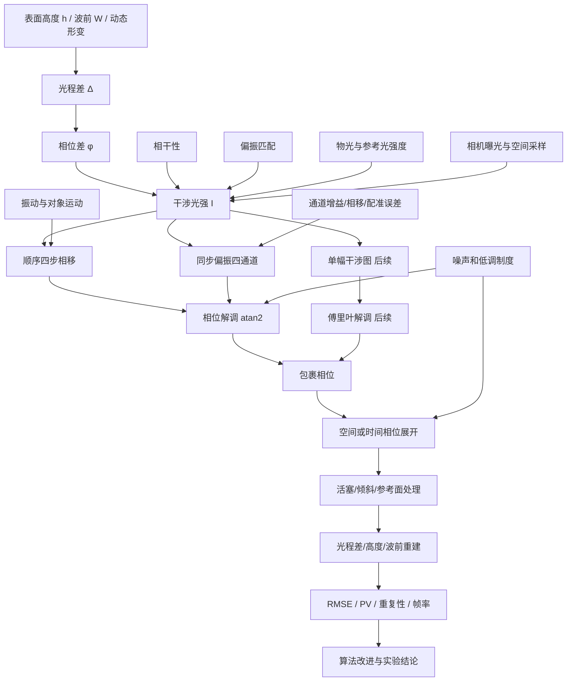

# 第一阶段知识地图与复习清单

## 1. 当前阶段判断

目前已经完成进入数值仿真所需的第一阶段基础理论：

- 双光束干涉与光程差；
- 相干条件与条纹可见度；
- 四步相移和包裹相位；
- 二维相位展开；
- 偏振光、Jones矩阵和同步偏振四步相移。

这意味着可以开始完成“已知相位—生成干涉图—恢复相位—评价误差”的Python闭环。

整个课题的理论尚未全部结束。完成基础仿真后，还需要继续学习：

- 动态顺序采集的误差模型；
- 单幅干涉图的傅里叶相位解调；
- 偏振相机标定、插值和通道校正；
- 实际干涉光路及实验误差；
- 动态重建的时间展开与实时处理。

## 2. 总体知识网络

## 3. 项目的主因果链

### 3.1 正向成像过程

$$
\boxed{
\text{表面或波前}
\rightarrow
\text{光程差}
\rightarrow
\text{相位差}
\rightarrow
\text{干涉光强}
\rightarrow
\text{相机图像}
}
$$

关键公式：

$$
\phi=\frac{2\pi}{\lambda}\Delta,
$$

$$
I(x,y)=A(x,y)+B(x,y)\cos\phi(x,y).
$$

对法向入射的反射表面：

$$
\Delta=2h,
\qquad
\phi=\frac{4\pi h}{\lambda}.
$$

### 3.2 反向测量过程

$$
\boxed{
\text{干涉图}
\rightarrow
\text{包裹相位}
\rightarrow
\text{展开相位}
\rightarrow
\text{光程差}
\rightarrow
\text{高度或波前}
}
$$

四步相移解调：

$$
\phi_w=
\mathrm{atan2}(I_4-I_2,I_1-I_3).
$$

反射表面高度：

$$
h=\pm\frac{\lambda}{4\pi}\phi_u.
$$

## 4. 五个知识模块

### 模块一：干涉成像基础

需要能够说明：

- 干涉项来自叠加电场平方中的交叉项；
- 相机记录时间平均光强，不直接记录电场或相位；
- 明暗条纹由物光和参考光的相位差决定；
- $A$ 是背景光强，$B$ 是条纹调制度，$\phi$ 是待测相位。

核心公式：

$$
I=I_1+I_2+2\sqrt{I_1I_2}\cos\phi.
$$

### 模块二：相干与条纹质量

需要能够说明：

- 相干的关键是相位关系稳定，不是相位差必须为零；
- 光程差对应两个光场状态的时间延迟；
- 光谱越宽，相干时间和相干长度越短；
- 光强平衡、相干性和偏振匹配共同决定条纹可见度；
- 短曝光减小运动模糊，但可能降低信噪比。

核心关系：

$$
\tau_c\sim\frac1{\Delta\nu},
\qquad
L_c=c\tau_c,
$$

$$
V=\frac{I_{\max}-I_{\min}}{I_{\max}+I_{\min}}.
$$

### 模块三：四步相移与相位解调

需要能够说明：

- 四幅图通过已知相移建立多组方程；
- 差分消去背景项，正交分量共同消去调制度；
- `atan2` 使用两个分量的符号确定象限；
- 顺序四步法要求四次采集期间 $A$、$B$、$\phi$ 不变且相移准确；
- 动态运动主要破坏 $\phi$ 不随采集时刻变化的假设。

核心公式：

$$
I_k=A+B\cos(\phi+\delta_k),
$$

$$
A=\frac{I_1+I_2+I_3+I_4}{4},
$$

$$
B=\frac12\sqrt{(I_1-I_3)^2+(I_4-I_2)^2}.
$$

### 模块四：包裹相位与相位展开

需要能够说明：

- 包裹相位只保留 $(-\pi,\pi]$ 内的主值；
- 算法只使用包裹相位，不会知道真实相位；
- 对相邻包裹相位差再次包裹，是消除跨越 $\pm\pi$ 边界造成的虚假 $2\pi$ 跳变；
- 局部相位差只有在相邻真实变化小于 $\pi$ 时才能唯一恢复；
- 最小二乘法全局拟合局部相位差，但不能消除严重欠采样的根本歧义；
- 展开结果仍有未知活塞项，可能还包含参考面倾斜。

核心关系：

$$
\phi_{\mathrm{true}}
=\phi_w+2\pi k,
$$

$$
g_x=\mathrm{wrap}
[\phi_w(i,j+1)-\phi_w(i,j)].
$$

### 模块五：偏振与同步相移

需要能够说明：

- Jones矢量由两个正交电场分量的复振幅组成；
- 光强使用共轭转置和模平方；
- 线偏振片将电场投影到透振轴；
- 波片保留两个正交分量并改变相对相位；
- 圆偏振的电场端点在固定位置随时间画圆；
- 两种相反旋向圆偏振经过检偏器后分别获得 $+\theta$ 和 $-\theta$ 投影相位；
- 四个微偏振方向对应四步相移，但位于不同物理像素，需要插值和标定。

核心关系：

$$
\boldsymbol J=
\begin{bmatrix}
A_xe^{i\varphi_x}\\
A_ye^{i\varphi_y}
\end{bmatrix},
$$

$$
a=\boldsymbol p^\dagger\boldsymbol J,
\qquad
\boldsymbol J_{\mathrm{out}}
=\boldsymbol p(\boldsymbol p^\dagger\boldsymbol J),
$$

$$
I_\theta=A+B\cos(\phi+2\theta).
$$

## 5. 三组必须区分的概念

### 5.1 真实电场、复振幅和Jones矢量

- 真实电场是随时间振动的实数矢量；
- 复振幅用复数同时记录振幅和相位；
- Jones矢量收集两个正交方向的复振幅。

### 5.2 相位差、包裹相位和展开相位

- 相位差是物光与参考光之间的真实物理量；
- 包裹相位是 `atan2` 在主值范围内给出的测量结果；
- 展开相位是在连续性假设下补偿整数个 $2\pi$ 的结果。

### 5.3 偏振片和波片

- 偏振片做方向投影，并损失正交分量；
- 波片主要引入正交分量之间的相位延迟；
- 同步偏振系统通常需要两者共同建立所需偏振状态和检测通道。

## 6. 动态干涉问题的核心矛盾

传统顺序相移希望

$$
\phi(x,y,t_1)=\phi(x,y,t_2)
=\phi(x,y,t_3)=\phi(x,y,t_4),
$$

但动态对象和环境振动会造成

$$
\phi(x,y,t_1)\neq\phi(x,y,t_2)
\neq\phi(x,y,t_3)\neq\phi(x,y,t_4).
$$

同步偏振方法通过一次曝光获得多个相移通道，减小时间不同步误差；代价是引入空间复用和通道不一致问题。

因此项目的主要研究逻辑是：

$$
\boxed{
\text{消除顺序采集的时间误差}
\quad\Longrightarrow\quad
\text{校正同步偏振系统的通道误差}
}
$$

## 7. 第一轮复习题

不看笔记，尝试用自己的话回答：

1. 为什么相机不能直接记录光场相位？
2. 双光束干涉公式中的交叉项从哪里来？
3. 为什么光程差超过相干长度后条纹逐渐变淡？
4. $A$、$B$、$\phi$ 分别代表什么，各自受哪些因素影响？
5. 四步相移如何消去 $A$ 和 $B$？
6. 为什么必须使用 `atan2` 而不是普通 `arctan`？
7. 包裹相位为什么不能直接转换为大范围连续高度？
8. 相邻真实相位变化超过 $\pi$ 时，基础展开算法为什么会产生歧义？
9. Jones矢量中的 $i$ 表示什么，为什么 $|i|^2=1$？
10. 线偏振片Jones矩阵为什么等于 $\boldsymbol p\boldsymbol p^\dagger$？
11. 为什么相反旋向圆偏振经过检偏器后产生 $2\theta$ 相移？
12. 同步偏振采集消除了什么误差，又引入了哪些误差？

## 8. 第一轮参考答案

### 8.1 为什么相机不能直接记录光场相位？

可见光电场的振荡频率约为 $10^{14}\ \mathrm{Hz}$，远高于普通相机的响应速度。相机在曝光时间内记录的是光强的时间平均值

$$
I\propto\left\langle |E(t)|^2\right\rangle_t,
$$

而不会逐时刻记录电场的正负变化。单独一束光的绝对相位因而不会直接出现在强度图中。干涉测量通过让待测光与参考光叠加，把二者的相位差编码成可测量的强度变化。

### 8.2 双光束干涉公式中的交叉项从哪里来？

总电场为 $E=E_1+E_2$。光强与总电场模平方成正比：

$$
|E_1+E_2|^2
=|E_1|^2+|E_2|^2+E_1E_2^*+E_1^*E_2.
$$

最后两项就是交叉项。写成振幅和相位后，它们合并为

$$
2\sqrt{I_1I_2}\cos(\phi_1-\phi_2),
$$

所以相位差最终表现为明暗条纹。

### 8.3 为什么光程差超过相干长度后条纹逐渐变淡？

光程差 $\Delta$ 对应时间延迟 $\tau=\Delta/c$。当延迟较小时，两束光仍然取自同一随机光场中彼此相关的时刻，交叉项可以稳定保留下来。当延迟增大到相干时间之外，不同频率成分积累的相位差彼此分散，曝光平均时交叉项相互抵消，条纹调制度下降。

更准确地说，相干长度不是绝对的硬边界。条纹可见度通常随 $|\Delta|$ 增大连续下降；“超过相干长度看不清”表示场的相关程度已经低于某个约定标准。

### 8.4 $A$、$B$、$\phi$ 分别代表什么？

在

$$
I=A+B\cos\phi
$$

中：

- $A$ 是平均背景光强，主要由物光、参考光、环境光、曝光和相机增益决定；
- $B$ 是干涉项的振幅或调制度，主要由两束光的强度匹配、相干度、偏振匹配和光路重合程度决定；
- $\phi$ 是物光与参考光的相位差，主要包含被测表面或波前造成的光程差，也会受到振动、空气扰动和系统像差影响。

理想标量双光束情况下，$A=I_{\mathrm{o}}+I_{\mathrm{r}}$，$B=2\sqrt{I_{\mathrm{o}}I_{\mathrm{r}}}$；实际情况下 $B$ 还要乘以相干度和偏振重合因子。

### 8.5 四步相移如何消去 $A$ 和 $B$？

采用 $0$、$\pi/2$、$\pi$、$3\pi/2$ 四个相移时：

$$
I_1-I_3=2B\cos\phi,
$$

$$
I_4-I_2=2B\sin\phi.
$$

相减后，背景项 $A$ 被消去；再计算

$$
\phi_w=\mathrm{atan2}(I_4-I_2,I_1-I_3),
$$

两个参数中具有相同的比例因子 $2B$，求方向角时该因子不影响结果。因此更准确地说，$B$ 并非在差分中变成零，而是在相位角计算中被共同尺度抵消。

### 8.6 为什么使用 `atan2` 而不是普通 `arctan`？

$\arctan(y/x)$ 只知道比值，无法区分 $(x,y)$ 与 $(-x,-y)$，而且 $x=0$ 时还会发生除零问题。$\mathrm{atan2}(y,x)$ 同时读取 $x$、$y$ 的符号，可以判断完整象限，并返回 $(-\pi,\pi]$ 内的包裹相位。

### 8.7 包裹相位为什么不能直接转换为大范围连续高度？

包裹相位只保留相位除以 $2\pi$ 后的余数。同一个包裹值可能对应

$$
\phi_w,\quad \phi_w+2\pi,\quad \phi_w+4\pi,\ldots
$$

直接代入高度公式会丢失这些整数周期。对于反射测量，一个 $2\pi$ 相位周期对应 $\lambda/2$ 的高度，因此直接转换只能得到对 $\lambda/2$ 取模的高度，而不是大范围连续形貌。

### 8.8 为什么相邻真实相位变化超过 $\pi$ 时会产生歧义？

基础展开算法通常把相邻像素之间主值范围内的最小相位差当作真实变化。如果真实变化超过 $\pi$，它和另一个相差 $2\pi$ 的较小变化会产生相同的包裹观测，算法仅凭这两个像素无法判断应补多少个 $2\pi$。这本质上是空间采样不足造成的信息丢失，普通展开不能凭空恢复已经丢失的信息。

### 8.9 Jones矢量中的 $i$ 表示什么？为什么 $|i|^2=1$？

$i=e^{i\pi/2}$ 表示相对相位超前 $\pi/2$，不是负的光强。复数的模平方要乘以复共轭：

$$
|i|^2=i\,i^*=i(-i)=1.
$$

因此 $[1,i]^{\mathrm T}/\sqrt2$ 的两个正交分量具有相等强度，只是相位相差 $\pi/2$。

### 8.10 为什么线偏振片Jones矩阵是 $\boldsymbol p\boldsymbol p^\dagger$？

设单位透振轴为 $\boldsymbol p$。先用内积

$$
a=\boldsymbol p^\dagger\boldsymbol J
$$

求入射电场沿透振轴的复振幅，再让出射场沿 $\boldsymbol p$ 方向：

$$
\boldsymbol J_{\mathrm{out}}
=\boldsymbol p a
=\boldsymbol p\boldsymbol p^\dagger\boldsymbol J.
$$

因此线偏振片对应的投影矩阵就是 $\boldsymbol P=\boldsymbol p\boldsymbol p^\dagger$。这里的 $\dagger$ 是共轭转置，用来正确计算复矢量内积。

### 8.11 为什么会产生 $2\theta$ 相移？

检偏方向为 $\boldsymbol p=[\cos\theta,\sin\theta]^{\mathrm T}$。两种相反旋向圆偏振可写成 $[1,i]^{\mathrm T}/\sqrt2$ 和 $[1,-i]^{\mathrm T}/\sqrt2$，其投影分别正比于

$$
\cos\theta+i\sin\theta=e^{i\theta},
$$

$$
\cos\theta-i\sin\theta=e^{-i\theta}.
$$

一束获得 $+\theta$，另一束获得 $-\theta$，两束投影光之间的相对相位变化为

$$
(+\theta)-(-\theta)=2\theta.
$$

所以检偏器旋转 $45^\circ$，干涉相移就是 $90^\circ$。

### 8.12 同步偏振采集消除了什么，又引入了什么？

它用一次曝光同时获得四个偏振相移通道，主要减小了顺序四步采集期间对象运动、环境振动和空气扰动造成的帧间相位变化，也减少了运动模糊之外的时间不同步误差。

它并没有消除所有误差，反而会引入或暴露：

- 四个通道的增益、背景和实际相移不一致；
- 微偏振片角度与消光比误差；
- 四类数据来自不同物理像素，需要插值、配准或超分辨率重建；
- 像素响应不一致、串扰、噪声和低调制度区域；
- 偏振态制备不理想以及波片延迟误差。

## 9. 第二轮计算题

1. 已知 $\lambda=632.8\ \mathrm{nm}$，反射表面升高 $100\ \mathrm{nm}$，计算相位变化。
2. 已知 $I_1=130$、$I_2=80$、$I_3=70$、$I_4=120$，计算包裹相位。
3. 将真实相位序列 $0$、$0.8\pi$、$1.2\pi$、$1.8\pi$ 转换为包裹相位，再进行一维展开。
4. 水平线偏振通过 $60^\circ$ 线偏振片，计算出射Jones矢量和光强比例。
5. 将 $45^\circ$ 线偏振依次通过快轴沿 $x$ 的四分之一波片，写出出射Jones矢量。

## 10. 第二轮参考答案

### 10.1 反射表面升高产生的相位变化

反射表面法向位移 $h$ 会造成往返光程差 $\Delta=2h$，因此

$$
\Delta\phi=\frac{2\pi}{\lambda}(2h)
=\frac{4\pi h}{\lambda}.
$$

代入 $h=100\ \mathrm{nm}$、$\lambda=632.8\ \mathrm{nm}$：

$$
\Delta\phi
=\frac{4\pi\times100}{632.8}
\approx1.986\ \mathrm{rad}
\approx0.632\pi
\approx113.8^\circ.
$$

这里给出的是相位变化量的大小；正负号取决于高度正方向和相位差的定义。

### 10.2 由四幅图计算包裹相位

按照本笔记的四步相移顺序：

$$
x=I_1-I_3=130-70=60,
$$

$$
y=I_4-I_2=120-80=40.
$$

因此

$$
\phi_w=\mathrm{atan2}(40,60)
\approx0.588\ \mathrm{rad}
\approx0.187\pi
\approx33.69^\circ.
$$

如果文献采用不同的相移排列或相位正方向，公式中的差分顺序可能改变，结果也可能相差一个负号。

### 10.3 包裹与一维展开

采用主值范围 $(-\pi,\pi]$，真实相位

$$
[0,\ 0.8\pi,\ 1.2\pi,\ 1.8\pi]
$$

包裹后为

$$
[0,\ 0.8\pi,\ -0.8\pi,\ -0.2\pi].
$$

相邻包裹值的直接差为 $0.8\pi$、$-1.6\pi$、$0.6\pi$。把差值再次限制到主值范围后得到

$$
[0.8\pi,\ 0.4\pi,\ 0.6\pi].
$$

从第一个点开始累加，展开结果为

$$
[0,\ 0.8\pi,\ 1.2\pi,\ 1.8\pi],
$$

与原序列相同。这里能够成功，是因为每一步真实相位变化都小于 $\pi$。

### 10.4 水平线偏振通过 $60^\circ$ 偏振片

归一化水平线偏振和透振轴分别为

$$
\boldsymbol J_{\mathrm{in}}=
\begin{bmatrix}1\\0\end{bmatrix},
\qquad
\boldsymbol p=
\begin{bmatrix}\cos60^\circ\\ \sin60^\circ\end{bmatrix}
=\begin{bmatrix}1/2\\ \sqrt3/2\end{bmatrix}.
$$

沿透振轴的复振幅为

$$
a=\boldsymbol p^{\mathrm T}\boldsymbol J_{\mathrm{in}}
=\cos60^\circ=\frac12.
$$

所以出射Jones矢量为

$$
\boldsymbol J_{\mathrm{out}}
=a\boldsymbol p
=\begin{bmatrix}1/4\\ \sqrt3/4\end{bmatrix}.
$$

光强比例为

$$
\frac{I_{\mathrm{out}}}{I_{\mathrm{in}}}
=\left\|\boldsymbol J_{\mathrm{out}}\right\|^2
=\cos^2 60^\circ
=\frac14.
$$

### 10.5 $45^\circ$ 线偏振通过四分之一波片

归一化入射Jones矢量为

$$
\boldsymbol J_{\mathrm{in}}
=\frac1{\sqrt2}
\begin{bmatrix}1\\1\end{bmatrix}.
$$

按照本笔记的约定，快轴沿 $x$、慢轴沿 $y$，且慢轴分量增加 $\pi/2$ 相位：

$$
\boldsymbol Q=
\begin{bmatrix}1&0\\0&i\end{bmatrix}.
$$

于是

$$
\boldsymbol J_{\mathrm{out}}
=\boldsymbol Q\boldsymbol J_{\mathrm{in}}
=\frac1{\sqrt2}
\begin{bmatrix}1\\i\end{bmatrix}.
$$

两个正交分量振幅相等、相位相差 $\pi/2$，所以出射光为圆偏振。若采用相反的时间因子或波片延迟符号约定，可能写成 $[1,-i]^{\mathrm T}/\sqrt2$；二者代表相反旋向，不是计算矛盾。

## 11. 仿真前自检标准

如果能够做到以下几点，就可以开始基础仿真：

- 能根据给定 $\phi(x,y)$ 写出四幅相移干涉图；
- 能解释 `atan2(I_4-I_2,I_1-I_3)` 的两个参数；
- 能区分真实相位、包裹相位和展开相位；
- 能根据反射模型把相位转换为相对高度；
- 能写出常见偏振态和线偏振片的Jones表示；
- 能指出顺序采集与同步偏振采集各自的主要误差。

完成自检后，下一步建立第一个Python仿真闭环。
